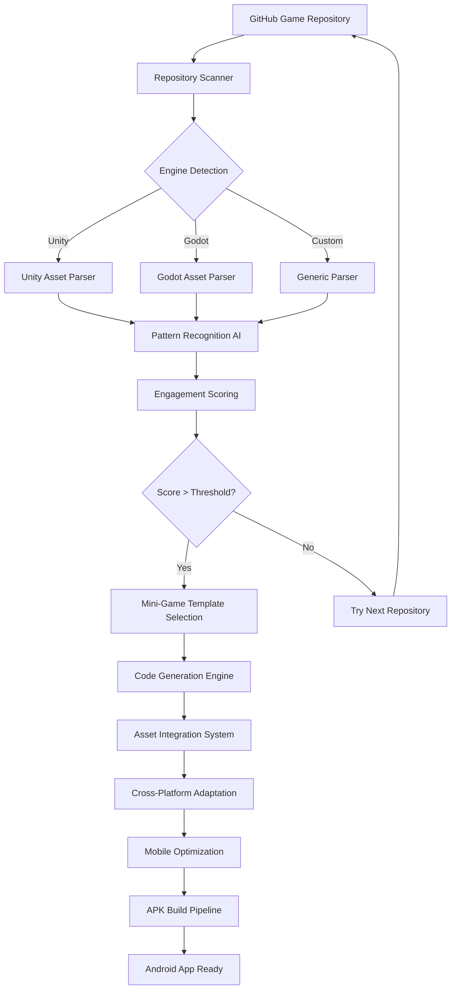
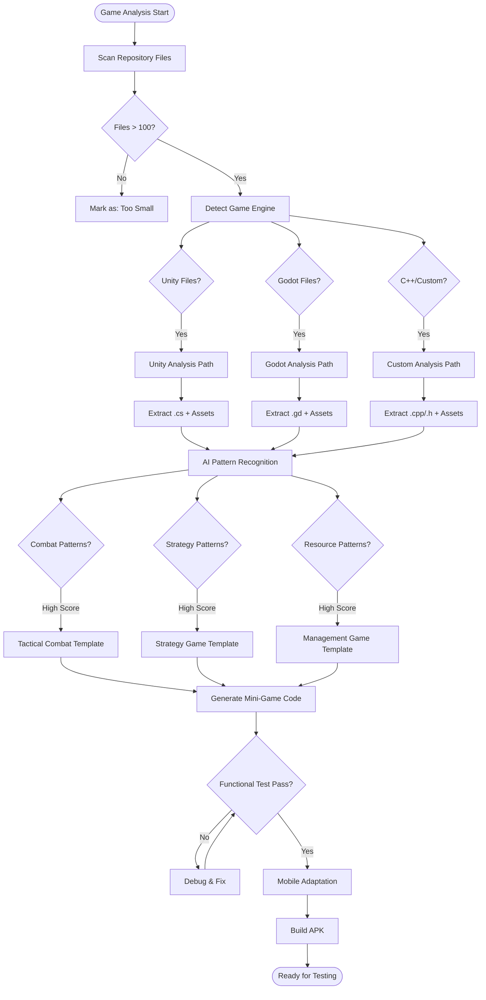
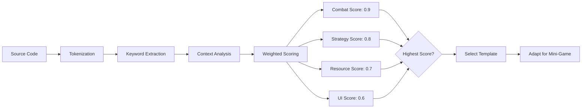
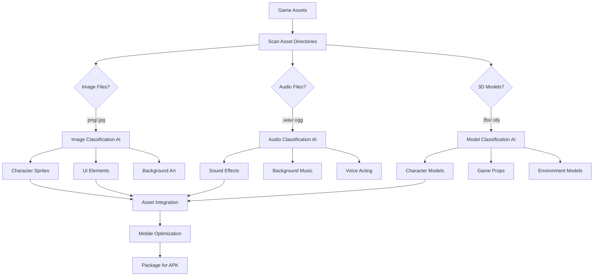

# AI Process Flowchart: Interactive Ad Generation

## High-Level Process Flow

## Detailed AI Decision Tree

## Pattern Recognition Algorithm

## Asset Processing Pipeline

This flowchart shows the complete AI decision-making process from analyzing a GitHub repository to generating a deployable Android app!